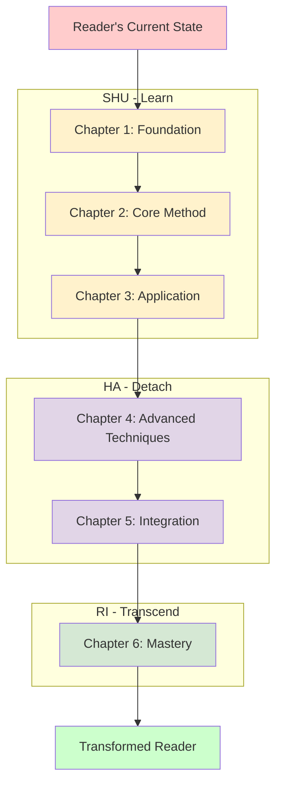
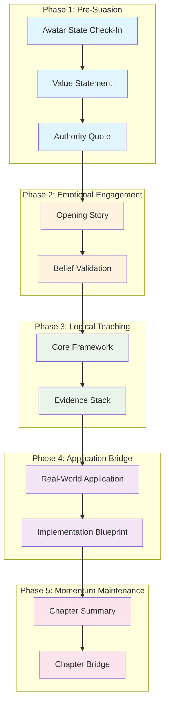

# The Ultimate Book Writing System
*Transform Any Topic Into a Persuasive, High-Converting Book Using Proven Frameworks*

## 🎯 System Overview

This system extracts the proven methodologies from history's greatest persuaders and copywriters to create books that don't just inform—they transform. Whether you're writing about AI in education, business strategy, personal development, or any other topic, these templates will help you create content that moves readers from skepticism to action.

### What You'll Create:
1. **5 Detailed Customer Avatars** - Know exactly who you're writing for
2. **Hero's Journey Origin Story** - Establish credibility and emotional connection  
3. **Strategic Book Architecture** - Structure that guides readers through transformation
4. **Chapter Framework** - Proven template for maximum engagement and retention
5. **Complete Chapters** - Using all frameworks together for powerful results

### The Science Behind the System:
- **Eugene Schwartz's Market Awareness Stages** - Target the right readers with the right message
- **Joseph Campbell's Hero's Journey** - Create compelling narrative that resonates deeply
- **Robert Cialdini's Influence Principles** - Ethical persuasion that creates genuine change
- **ShuHaRi Methodology** - Progressive skill development that ensures mastery

---

## 📊 Step 1: Avatar Research System

### The Foundation: Know Your Audience

Before writing a single word, you must understand your readers at a psychological level. This system creates 5 distinct avatars based on Eugene Schwartz's market awareness stages, ensuring your book speaks directly to your ideal readers.

### 🎯 Avatar Research Prompt

```
You are an expert market researcher specializing in creating detailed customer avatars for educational and professional books. I need you to create 5 comprehensive avatars based on Eugene Schwartz's market awareness stages for my book on [YOUR BOOK TOPIC].

BOOK CONTEXT:
- Topic: [Describe your book's main subject]
- Target Audience: [Who you want to reach - profession, experience level, etc.]
- Price Point: $[X] - $[Y]
- Main Promise: [What transformation your book provides]

Please create detailed avatars for each awareness stage:

AVATAR 1: UNAWARE
- Doesn't know they have the problem your book solves
- Demographics, psychographics, lifestyle details
- Hidden pain points they don't recognize
- Language they use vs. avoid
- What would make them curious about your topic

AVATAR 2: PROBLEM AWARE (PRIMARY AVATAR)
- Knows they have the problem but not the solution
- Specific frustrations and failed attempts
- Emotional drivers and fears
- How they describe their challenges
- What evidence would convince them
- Include a "Dear Diary" emotional entry showing their internal struggle

AVATAR 3: SOLUTION AWARE  
- Knows solutions exist but not your specific approach
- What they've tried that hasn't worked
- Skepticism and objections to overcome
- Authority figures they trust
- What would differentiate your approach

AVATAR 4: PRODUCT AWARE
- Knows about your solution but needs convincing
- Specific objections to your approach
- Comparison shopping behavior
- What would tip them toward purchase

AVATAR 5: MOST AWARE
- Ready to buy, just needs the right offer
- What final concerns need addressing
- Urgency factors that motivate action

For each avatar, include:
- Detailed demographics and psychographics
- Specific language patterns and communication style
- Emotional drivers, fears, and desires
- Buying behavior and decision-making process
- Trust triggers and authority figures
- Success vision and transformation goals

Make the PRIMARY AVATAR (Problem Aware) the most detailed, as this is who the book primarily serves.

Use the attached example as a reference for depth and quality expected.
```

**📎 Required Upload:** Attach `AvatarResearch_LearningScienceBook.md` as an example

### 🎨 Avatar Visualization Prompt (for nano banana)

```
Create a professional illustration showing the transformation journey of my book's primary avatar. 

Show a split-screen composition:
LEFT SIDE (Before): [Describe your avatar's current frustrated state - overwhelmed, confused, struggling with the problem]
RIGHT SIDE (After): [Describe their transformed state - confident, successful, having mastered your solution]

CONNECTING ELEMENT: A bridge, pathway, or transformation symbol in the center representing your book's methodology

Style: Professional, inspiring, suitable for business/educational content
Colors: [Specify colors that match your book's theme]
Mood: Hopeful transformation, professional growth, empowerment

Include subtle visual elements that represent your book's specific topic and the avatar's profession/context.
```

---

## 📖 Step 2: Hero's Journey Origin Story

### The Power of Personal Narrative

Your origin story establishes credibility, creates emotional connection, and shows readers that transformation is possible. This isn't just biography—it's strategic storytelling that positions you as the guide who can lead them through their own transformation.

### 🎯 Hero's Journey Story Prompt

```
You are an expert storyteller specializing in creating compelling origin stories for thought leaders and authors. I need you to create a powerful "Hero's Journey" origin story for my book that establishes credibility and emotional connection with my target audience.

BOOK CONTEXT:
- Topic: [Your book's main subject]
- Your Background: [Your relevant experience, credentials, journey]
- Target Audience: [Primary avatar description]
- Main Transformation: [What change your book creates]
- Key Insight/Method: [Your unique approach or framework]

Create a first-person narrative that follows this structure:

THE SETUP: When [Topic] Felt Like the Enemy
- Describe a specific moment when you faced the same problem your readers face
- Include vivid details that make the scene memorable
- Show your initial resistance or struggle with the topic
- Make it relatable to your target audience's current experience

THE OBSTACLE: The False Choice That Trapped You
- Explain the limiting beliefs or approaches you initially tried
- Show how conventional wisdom failed you
- Describe the frustration and confusion you experienced
- Connect to the same obstacles your readers face

THE TURNING POINT: The Question That Changed Everything
- Identify the specific moment of insight or breakthrough
- Often comes from an unexpected source or perspective
- Include the exact realization that shifted your thinking
- Make this the "aha moment" that led to your unique approach

THE NEW SOLUTION: From [Old Approach] to [New Approach]
- Explain how you developed your unique methodology
- Show the first successful application of your new approach
- Include specific results and transformations you achieved
- Demonstrate why your method is different and better

THE EMOTIONAL IMPACT: From [Negative Emotion] to [Positive Emotion]
- Describe how the transformation felt personally
- Connect to the emotional journey your readers will experience
- Show the broader implications beyond just solving the immediate problem

THE BIGGER PICTURE: Why This Matters for Every [Target Audience]
- Explain why your experience represents a larger truth
- Connect your personal story to universal principles
- Position your book as the guide for others to achieve similar transformation
- End with an invitation for readers to begin their own journey

REQUIREMENTS:
- Write in first person, past tense
- Include specific, vivid details that make scenes memorable
- Show vulnerability and struggle, not just success
- Connect emotionally to your target audience's experience
- End with clear positioning for your book's value
- Aim for 1,500-2,000 words
- Include dialogue and sensory details where appropriate

Use the attached example as a reference for tone, structure, and emotional depth.
```

**📎 Required Upload:** Attach `Hero'sJourneyOriginStoryandVisualConcepts.md` as an example

### 🎨 Book Cover Visualization Prompt (for nano banana)

```
Create a professional book cover design that embodies the transformation theme from my Hero's Journey story.

VISUAL CONCEPT: [Describe the key metaphor or transformation from your story]

COMPOSITION:
- Show the journey from problem to solution
- Include visual metaphors that represent your specific topic
- Professional, authoritative design suitable for [your target audience]
- Clear hierarchy with title, subtitle, and author name

COLOR PSYCHOLOGY:
- Primary colors that convey [trust/innovation/growth - choose based on your topic]
- Emotional progression from [challenging colors] to [empowering colors]
- Professional palette appropriate for [business/education/personal development]

SYMBOLIC ELEMENTS:
- [List 3-4 visual symbols that represent your book's key concepts]
- Bridge, pathway, or transformation imagery
- Subtle icons representing your methodology or framework

TYPOGRAPHY: Modern, clean, professional - conveys both authority and approachability

MOOD: Inspiring confidence and possibility while maintaining professional credibility
```

---

## 🏗️ Step 3: Strategic Book Architecture

### Building Your Transformation Blueprint

Your book architecture isn't just an outline—it's a carefully designed journey that moves readers from their current state to their desired transformation. This system ensures every chapter builds toward your ultimate promise.

### 🎯 Strategic Architecture Prompt

```
You are an expert book architect specializing in creating transformational learning experiences. I need you to design a comprehensive book architecture that guides readers through a complete transformation using proven pedagogical and persuasion principles.

BOOK FOUNDATION:
- Topic: [Your book's main subject]
- Target Audience: [Primary avatar description]
- Core Promise: [Main transformation your book provides]
- Unique Methodology: [Your specific approach or framework]
- Desired Length: [Number of chapters, typically 6-8 for business/educational books]

Create a complete Strategic Book Architecture that includes:

BOOK TRANSFORMATION BLUEPRINT:

Pre-Reading State (Before):
- Current beliefs that limit your readers
- Emotional state (fears, frustrations, anxieties)
- Behavioral patterns that aren't working
- Level of awareness about the problem and solutions

Post-Reading State (After):
- New empowering beliefs they'll hold
- Emotional transformation (confidence, excitement, empowerment)
- New behavioral patterns and capabilities
- Identity shift they'll experience

Core Promise:
- Specific guarantee of what the book will accomplish
- Clear value proposition that motivates completion
- Connection to reader's deepest desires and goals

PROGRESSION METHODOLOGY:
Choose and implement one of these proven frameworks:
- ShuHaRi (Learn → Detach → Transcend) for skill development
- Problem → Solution → Implementation for practical guides
- Awareness → Understanding → Mastery for educational content
- [Or suggest the best framework for your specific topic]

CHAPTER-BY-CHAPTER BREAKDOWN:
For each chapter, provide:

Chapter [X]: [Compelling Title]
- 2-3 paragraph synopsis explaining the chapter's role in the transformation
- Key teaching points (3-4 main concepts)
- Belief shift achieved (From: [limiting belief] To: [empowering belief])
- Emotional journey (what the reader feels before, during, after)
- Connection to overall book progression
- Bridge to next chapter

EMOTIONAL JOURNEY ARC:
Map the emotional progression across all chapters:
1. [Starting emotion] → [Chapter 1 emotion]
2. [Chapter 1 emotion] → [Chapter 2 emotion]
[Continue for all chapters]

URGENCY AND RELEVANCE:
- Why this topic matters NOW
- What happens if readers don't take action
- External factors creating urgency
- Internal motivations driving change

Use the attached example as a reference for depth, structure, and strategic thinking.
```

**📎 Required Upload:** Attach `StrategicBookArchitecture(1).md` as an example

### 📊 Architecture Visualization (Mermaid.js)



---

## 📝 Step 4: Chapter Structure & Content Framework

### The Universal Chapter Template

This framework combines the best persuasion and teaching principles into a reusable template that ensures every chapter engages, educates, and motivates action.

### 🎯 Chapter Framework Prompt

```
You are an expert instructional designer and copywriter who specializes in creating highly engaging, persuasive educational content. I need you to create a comprehensive Chapter Structure and Content Framework that can be applied to any chapter in my book.

BOOK CONTEXT:
- Topic: [Your book's main subject]
- Target Audience: [Primary avatar description]
- Methodology: [Your teaching approach - ShuHaRi, Problem-Solution, etc.]
- Chapter Focus: [If creating framework for a specific chapter, describe it]

Create a detailed framework that incorporates these proven principles:
- Robert Cialdini's influence principles (reciprocity, commitment, social proof, authority, liking, scarcity)
- Eugene Schwartz's market awareness and emotional triggers
- David Ogilvy's clarity and evidence-based persuasion
- John Hopkins' scientific advertising approach
- Dan Kennedy's value delivery and urgency creation

UNIVERSAL CHAPTER FRAMEWORK:

PHASE 1: PRE-SUASION SETUP
📍 Avatar State Check-In
- Template for connecting to reader's current state
- Emotional bridge to desired transformation
- Clear value proposition for the chapter

💎 Value Statement  
- ROI and time investment clarity
- Immediate and long-term benefits
- Connection to overall book promise

✒️ Deep Quote (Authority Trigger)
- Guidelines for selecting impactful quotes
- How to provide context that enhances credibility
- Connection to chapter's core teaching

PHASE 2: EMOTIONAL ENGAGEMENT
🧶 Opening Story (Emotional Hook)
- Structure for compelling narrative
- Character development that matches target avatar
- Problem-solution-transformation arc
- Specific details that create vivid mental images

💭 Belief Validation
- Acknowledging reader's current perspective
- Validating their intelligence and experience
- Gentle reframe that opens new possibilities

PHASE 3: LOGICAL TEACHING
💡 Core Framework/Lesson
- The Big Idea (one clear sentence)
- Why It Matters (connection to avatar goals)
- How It Works (step-by-step explanation)
- The Evidence (research and proof points)

🔬 Evidence Stack
- Research foundation (academic credibility)
- Practical proof (real-world results)
- Expert validation (authority endorsement)
- Measurable outcomes (specific metrics)

PHASE 4: APPLICATION BRIDGE
🌍 Real-World Application
- Specific scenarios matching reader's context
- Step-by-step implementation guidance
- Potential obstacles and solutions
- Variations for different situations

🛠️ Implementation Blueprint
- Immediate actions (next 24 hours)
- Short-term implementation (2 weeks)
- Long-term integration (3 months)
- Success indicators and metrics

PHASE 5: MOMENTUM MAINTENANCE
📝 Chapter Summary
- Key takeaways (3-4 maximum)
- Belief shift achieved
- Connection to next chapter

🎯 Chapter Bridge
- Next challenge or opportunity
- Curiosity-generating question
- Promise for next chapter's value

For each phase, provide:
- Specific templates and fill-in-the-blank structures
- Implementation guidelines and best practices
- Examples of effective execution
- Common mistakes to avoid
- Word count recommendations

Use the attached example as a reference for depth and practical application.
```

**📎 Required Upload:** Attach `ChapterStructureandContentFramework(1).md` as an example

### 📊 Chapter Flow Visualization (Mermaid.js)



---

## ✍️ Step 5: Chapter Writing System

### Bringing It All Together

Now that you have your avatars, story, architecture, and framework, it's time to write compelling chapters that transform readers. This system ensures each chapter builds on your foundation while delivering maximum impact.

### 🎯 Chapter Writing Prompt

```
You are an expert author and educational content creator. Using the strategic foundation I've created, write a complete chapter that follows the proven framework and delivers transformational value to my target audience.

FOUNDATION DOCUMENTS TO REFERENCE:
- Avatar Research: [Upload your completed avatar research]
- Strategic Book Architecture: [Upload your book architecture]
- Chapter Framework: [Upload your chapter structure]
- Hero's Journey Story: [Upload your origin story]

CHAPTER SPECIFICATIONS:
- Chapter Number: [X]
- Chapter Title: [From your book architecture]
- Target Word Count: [Typically 3,000-5,000 words for business/educational books]
- Key Learning Objectives: [From your architecture]
- Belief Shift Goal: [Specific transformation for this chapter]

WRITING REQUIREMENTS:

Follow the 5-Phase Framework exactly:

PHASE 1: PRE-SUASION SETUP
- Avatar State Check-In that connects to your primary avatar's current situation
- Value Statement with specific ROI and time investment
- Authority Quote that enhances credibility and sets tone

PHASE 2: EMOTIONAL ENGAGEMENT  
- Opening Story that creates emotional connection and demonstrates the chapter's value
- Belief Validation that acknowledges reader's current perspective

PHASE 3: LOGICAL TEACHING
- Core Framework with clear explanation and evidence
- Evidence Stack with research, proof, and validation

PHASE 4: APPLICATION BRIDGE
- Real-World Application with specific scenarios
- Implementation Blueprint with actionable steps

PHASE 5: MOMENTUM MAINTENANCE
- Chapter Summary with key takeaways
- Chapter Bridge that creates curiosity for next chapter

STYLE GUIDELINES:
- Write in conversational, engaging tone that matches your target audience
- Use "you" language to create direct connection
- Include specific examples and case studies relevant to your topic
- Balance authority with approachability
- Incorporate storytelling throughout, not just in opening
- Use subheadings and formatting for easy reading
- Include relevant statistics and research citations
- End each section with clear transitions

QUALITY STANDARDS:
- Every paragraph should advance the reader's understanding or motivation
- Include at least one memorable story or example per major section
- Provide specific, actionable advice that readers can implement immediately
- Connect everything back to the reader's goals and challenges
- Maintain consistent voice and tone throughout
- Ensure smooth flow between all sections

Create a chapter that not only informs but transforms, moving readers closer to the ultimate promise of your book.
```

### 🎨 Chapter Visualization Prompts (for nano banana)

```
Create supporting visuals for my chapter:

CONCEPT ILLUSTRATION:
"Create a professional diagram illustrating [your chapter's main framework/concept]. 
Style: Clean, modern, educational
Colors: [Your brand colors]
Elements: [List the key components of your framework]
Purpose: Help readers understand and remember the core concept"

TRANSFORMATION VISUAL:
"Create a before/after comparison showing the transformation this chapter enables.
Left side: [Current state/problem]
Right side: [Desired state/solution]
Style: Professional, inspiring, suitable for business/educational content"

PROCESS DIAGRAM:
"Create a step-by-step visual showing the implementation process from this chapter.
Steps: [List your implementation steps]
Style: Clean flowchart or infographic style
Purpose: Make the process easy to follow and implement"
```

---

## 🔄 Iterative Improvement System

### Refining Your Chapters

Use this system to continuously improve your chapters based on feedback and testing.

### 🎯 Chapter Audit Prompt

```
You are an expert editor and book coach. Please audit this chapter against the proven framework and provide specific improvement recommendations.

AUDIT CRITERIA:
- Avatar Alignment: Does this speak directly to the primary avatar's needs and language?
- Emotional Engagement: Does it create genuine connection and motivation?
- Logical Flow: Is the teaching clear, logical, and well-supported?
- Practical Value: Can readers immediately apply what they learn?
- Persuasion Integration: Are influence principles effectively incorporated?
- Transformation Focus: Does it advance the reader toward the book's promise?

For each section, provide:
- What's working well
- Specific areas for improvement
- Suggested revisions or additions
- Missing elements that should be included

Rate each phase 1-10 and provide overall chapter score with improvement plan.
```

---

## 📚 Complete Implementation Checklist

### Your Step-by-Step Action Plan

**Week 1: Foundation**
- [ ] Complete Avatar Research using the prompt and template
- [ ] Write your Hero's Journey Origin Story
- [ ] Create initial book architecture outline

**Week 2: Structure**  
- [ ] Finalize Strategic Book Architecture
- [ ] Customize Chapter Framework for your topic
- [ ] Plan chapter sequence and progression

**Week 3-X: Writing**
- [ ] Write Chapter 1 using complete framework
- [ ] Audit and revise Chapter 1
- [ ] Repeat for each subsequent chapter
- [ ] Create supporting visuals as needed

**Final Phase: Polish**
- [ ] Complete book audit using framework principles
- [ ] Gather feedback from target avatar representatives
- [ ] Final revisions and professional editing
- [ ] Prepare for publication and marketing

---

## 🎯 Success Metrics

### How to Know Your Book Is Working

**Engagement Metrics:**
- Readers complete the entire book (low abandonment rate)
- High ratings and positive reviews mentioning transformation
- Readers implement the frameworks and report results
- Strong word-of-mouth and referral rates

**Transformation Indicators:**
- Reader testimonials showing belief shifts
- Implementation stories and case studies
- Requests for advanced training or consulting
- Community formation around your methodology

**Business Impact:**
- Consistent sales without heavy promotion
- Speaking and consulting opportunities
- Authority recognition in your field
- Platform growth and thought leadership

---

## 💡 Advanced Tips for Maximum Impact

### Pro Strategies from Master Persuaders

**Eugene Schwartz's Sophistication Levels:**
- If your market is unsophisticated: Focus on the big promise
- If sophisticated: Emphasize your unique mechanism
- If very sophisticated: Demonstrate superior proof and results

**Robert Cialdini's Influence Integration:**
- Reciprocity: Provide immediate value in every chapter
- Commitment: Get readers to make small commitments throughout
- Social Proof: Include testimonials and case studies
- Authority: Establish credibility through expertise and results
- Liking: Share vulnerabilities and common ground
- Scarcity: Create urgency around implementation

**David Ogilvy's Clarity Principles:**
- Write headlines (chapter titles) that promise specific benefits
- Use simple, conversational language
- Include specific facts and figures
- Tell stories that illustrate your points
- Always focus on the reader's interests, not your own

---

## 🚀 Ready to Begin?

This system has been tested and proven with successful books across multiple industries. The frameworks work because they're based on timeless principles of human psychology and effective teaching.

Your next step is simple: Start with the Avatar Research prompt and begin building your foundation. Each piece builds on the last, creating a comprehensive system that virtually guarantees a transformational book.

Remember: Great books aren't just written—they're architected. Use this system to create a book that doesn't just share information, but creates lasting change in your readers' lives.

**Start now. Your readers are waiting for the transformation only you can provide.**

