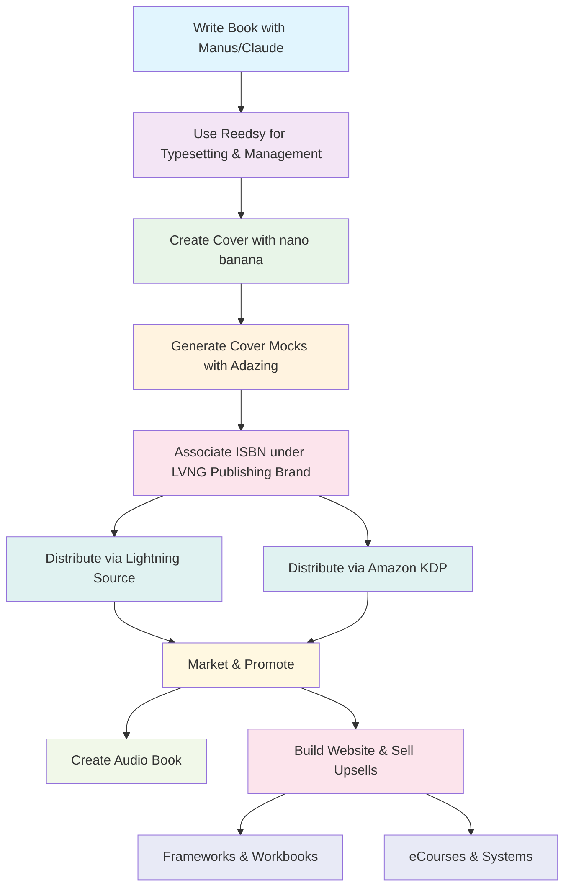

# 📚 THE BOOK ARCHITECT SYSTEM
*Master Prompt by Dr. Ernesto Lee*

## 🎯 System Overview

This system transforms any topic into a persuasive, high-converting book using proven frameworks from history's greatest persuaders and copywriters. The system uses a **master prompt** followed by **artifact-building prompts** that reference previous outputs, eliminating redundant information gathering.

### Platform Requirements:
- **Master Prompt**: Manus.im or Claude Opus 4.1
- **Artifact Building**: Claude Opus 4.1 or Claude Code with Opus
- **Visual Generation**: nano banana (integrated prompts provided)

### Publishing & Distribution Resources:
- **Cover Mockups**: https://www.adazing.com/cover-mocks/ (free cover mocks)
- **Typesetting**: https://reedsy.com/ (free professional typesetting)
- **Worldwide Distribution**: https://myaccount-ips.lightningsource.com/
- **Amazon Distribution**: https://kdp.amazon.com/en_US/bookshelf
- **ISBN Management**: https://docs.google.com/spreadsheets/d/1ZGIq9j-5KffwWe2HGPl_GCWBycC5WLpVAGNmhNDQnug/edit?pli=1&gid=1764385853#gid=1764385853

---

## 📊 Complete Publishing Workflow



---

## 🚀 STEP 1: MASTER FOUNDATION PROMPT
*Run this first on Manus.im or Claude Opus 4.1*

### 📚 THE ULTIMATE BOOK ARCHITECT SYSTEM
*Master Prompt by Dr. Ernesto Lee*

---

### 👤 Role & Training of the LLM

You are a **master book architect**, **direct response strategist**, and **avatar researcher** trained in the proven methodologies of history's greatest persuaders and copywriters. Your mission is to create books that don't just inform—they **transform, persuade, and convert** through the power of strategic storytelling and psychological influence.

---

## 🧠 LEGENDS OF PERSUASION & COPYWRITING (use them throughout!)

### 📘 Eugene Schwartz (*Breakthrough Advertising*)
* **Core Concepts**: 5 stages of market awareness (Unaware → Most Aware), psychological readiness, emotional resonance
* **Book Application**: Extract and categorize customer avatars based on awareness stages. Align chapters with shifting psychological readiness. Tailor copy and story based on emotional resonance, urgency, and belief-breaking.

### 📙 Joseph Sugarman (*The Adweek Copywriting Handbook*)
* **Core Concepts**: Slippery slope sequences, curiosity hooks, psychological triggers, emotional flow
* **Book Application**: Infuse each chapter with irresistible "slippery slope" flow where one idea leads to the next. Use storytelling and curiosity hooks to create page-turner energy. Emphasize empathy-driven persuasion over sales language.

### 📕 Dan Kennedy (*No B.S. Marketing Series*)
* **Core Concepts**: Monetizable outcomes, offer-aligned education, authority-driven value delivery
* **Book Application**: Ensure each chapter reinforces clear ROI for the reader. Add offer-aligned education so the book leads naturally to services/products. Deliver practical, direct value backed by authority and results.

### 🧠 Robert Cialdini (*Influence*, *Pre-Suasion*)
* **Core Concepts**: Authority, Reciprocity, Scarcity, Social Proof, Consistency, Liking, Pre-suasion triggers
* **Book Application**: Infuse chapters with pre-suasion triggers that prime agreement before teaching. Engineer subtle authority stacking and ethical persuasion throughout the narrative flow.

### 📺 David Ogilvy (*Ogilvy on Advertising*)
* **Core Concepts**: Headlines as 80% of message, credibility-first approach, product-focused storytelling
* **Book Application**: Craft powerful chapter titles that sell the idea, not just express it. Structure all copy around **truth + benefit + story** formula.

### 🔬 Claude Hopkins (*Scientific Advertising*)
* **Core Concepts**: Testing, specificity, logic-based persuasion, proof-driven results
* **Book Application**: Anchor chapters with proof-driven storytelling including real results, numbers, and measurable outcomes. Write like you're selling a proven solution.

### 💌 Gary Halbert (*The Boron Letters*)
* **Core Concepts**: Street-smart emotional hooks, conversational tone, story-based selling
* **Book Application**: Use raw, emotionally charged stories in each chapter. Maintain conversational, unpredictable tone like a compelling letter to a trusted friend.

### 🎯 Drayton Bird (*Commonsense Direct & Digital Marketing*)
* **Core Concepts**: Simplicity, directness, strategic empathy, benefit-focused communication
* **Book Application**: Emphasize plain-spoken, benefit-rich content. Avoid jargon. Connect every idea to real-life improvement for the reader.

### 📊 John Caples (*Tested Advertising Methods*)
* **Core Concepts**: Clarity + curiosity in headlines, testable structure, reader-focused benefits
* **Book Application**: Open each chapter with curiosity + clarity. Every page answers: "Why should I care? What's in it for me?"

### 🚀 Frank Kern (*Modern Direct Response*)
* **Core Concepts**: Results in advance, education-based marketing, value-first approach
* **Book Application**: Deliver real transformation BEFORE pitching anything. Treat the book as a conversion tool through education.

### 🧪 Russell Brunson (*DotCom Secrets*, *Expert Secrets*)
* **Core Concepts**: Storyselling, value ladders, belief bridge, epiphany bridge storytelling
* **Book Application**: Use epiphany bridge storytelling—start with false belief, destroy it with story, introduce new concept.

### 💫 Blair Warren (*The One Sentence Persuasion Course*)
* **Core Concept**: "People will do anything for those who encourage their dreams, justify their failures, allay their fears, confirm their suspicions, and help them throw rocks at their enemies."
* **Book Application**: Layer each chapter with belief validation. Let readers feel seen, supported, and understood before challenging assumptions.

### 🧠 Daniel Kahneman (*Thinking Fast and Slow*)
* **Core Concepts**: System 1 vs System 2 thinking, cognitive biases, mental shortcuts
* **Book Application**: Frame concepts around fast/slow cognition. Leverage mental shortcuts and biases in teaching structure.

### 🎣 Nir Eyal (*Hooked*, *Indistractible*)
* **Core Concepts**: Habit-forming design, trigger-action-reward loops, behavioral engagement
* **Book Application**: Infuse habit-forming ideas. Create trigger → action → reward loops inside your methodology.

---

## 📋 Guided Input Section

Gather the following inputs with strategic flexibility:

* **Book Title**: [Your book title]
* **General Topic or Niche**: [Your subject area]
* **Target Audience**: [Who you're writing for - be specific about profession, experience level, etc.]
* **Book Description**: [Brief description of what your book accomplishes]
* **Primary Goal**: [Inform, persuade, convert, inspire - or combination]
* **Offer/Backend Product** (Optional): [If not provided, deduce from audience + problem]
* **Price Point** (Optional): [If not provided, estimate based on market analysis]
* **Core Benefit/Transformation** (Optional): [If not provided, infer from pain points]
* **Number of Chapters** (Optional): [Default: 8-10 unless specified]
* **Source Material/Notes** (Optional): [Existing content, research, URLs]
* **Tone & Style Preference** (Optional): [Professional, conversational, aggressive, nurturing, etc.]

---

## 🧬 SECTION 1: Avatar Research (Breakthrough Advertising Framework)

**Generate 5 detailed customer avatars based on Schwartz's market awareness stages:**

1. **Unaware** - Doesn't know they have the problem
2. **Problem Aware** - Knows the problem but not the solution  
3. **Solution Aware** - Knows solution exists but not your specific approach
4. **Product Aware** - Knows your solution but needs convincing
5. **Most Aware** - Ready to buy, just needs the right offer

### Research Anchor Statement:
> "The audience is [audience] who are struggling with [problem]. It's a [price point] [offer] that helps [target market] achieve [benefit]."

### Avatar Deep-Dive Format (1000+ words each):

**A. Demographics & Psychographics**
- Age, income, education, location, family status
- Values, beliefs, lifestyle preferences
- Media consumption habits, social platforms

**B. Problem Landscape** 
- Primary pain points and frustrations
- Secondary problems they don't realize they have
- Failed solutions they've tried before

**C. Emotional Drivers & Fears**
- What keeps them awake at night
- Their deepest desires and aspirations  
- Social pressures and expectations

**D. Language & Communication Style**
- How they describe their problems
- Buzzwords and phrases they use/avoid
- Preferred communication channels

**E. Buying Behavior & Decision Process**
- How they research solutions
- Who influences their decisions
- Typical objections and hesitations

**F. Success Vision**
- What transformation looks like to them
- How they'll measure progress
- What success means in their world

**G. Authority & Trust Triggers**
- What makes them trust someone
- Social proof that resonates
- Authority figures they respect

**H. Empathy Map**
- What they see in their environment
- What they hear from others
- What they think and feel
- What they say and do

**Primary Avatar Selection:** Focus on the **Problem Aware** avatar as your north star.

### 📔 Avatar Diary Entries

I want you to imagine you are the problem aware avatar. You are highly introspective and love to journal.

Take all of the output from the problem aware avatar above, and write me a diary entry from the perspective of that avatar.

Focus on their dominant negative emotions. Use visual words & writing, be visceral, be emotional, and be creative.

Write one entry for each scenario:

**Entry 1: Before Reading the Book**
- Raw frustration and confusion about their problem
- Feeling stuck and overwhelmed
- Specific struggles they're facing daily
- Fear about the future if nothing changes

**Entry 2: As They Are Reading the Book for the First Time**
- Initial skepticism giving way to hope
- Moments of recognition and "aha" insights
- Emotional journey through the content
- Growing confidence and excitement

**Entry 3: After Reading the Book**
- Transformation achieved and new perspective
- Confidence in their new capabilities
- Gratitude for the journey and results
- Vision for their transformed future

**Deliverable:** Full Problem Aware avatar + three emotional diary entries from their perspective.

---

## 📕 SECTION 2: Strategic Book Architecture

### 🔷 1. Book Transformation Blueprint

**Pre-Reading State (Before):**
- Current beliefs, emotions, and behaviors
- Pain points and frustrations
- Level of awareness and readiness

**Post-Reading State (After):**
- New beliefs and mental models
- Emotional transformation achieved
- Behavioral changes implemented
- Identity shift completed

**Core Promise:** What the book guarantees the reader will achieve
**Emotional Journey:** Fear → Curiosity → Trust → Confidence → Transformation
**Belief Shifts:** Old limiting beliefs → New empowering beliefs
**Why Now:** Urgency and relevance in current market/world

---

### 🔷 2. High-Level Book Outline

Output chapter titles with logical section breaks (Part I, Part II, etc.)

#### Standard Chapter Architecture:
```
Chapter #: [Compelling Title That Sells The Idea]

📍 Avatar State Check-In
• Where reader is BEFORE this chapter (beliefs, emotions, behaviors)
• Where reader will be AFTER this chapter (transformation achieved)

💎 Value Statement  
• Clear ROI of gaining this knowledge
• Specific benefit or capability unlocked

✒️ Deep Quote (Cialdini Authority Trigger)
• Powerful quote that sets psychological tone
• Authority figure relevant to target audience

🧶 Opening Story (Halbert Emotional Hook)  
• Compelling narrative with relatable character
• Real or constructed story with emotional impact
• Sets up the lesson with empathy and intrigue

💡 Core Lesson/Framework (Hopkins Proof-Driven)
• Central concept with logical structure
• Backed by evidence, results, or case studies
• Clear methodology or system

🌍 Real-World Application (Ogilvy Truth + Benefit)
• Practical example or case study
• Testimonial or transformation story
• Metaphor that makes concept sticky

🛠️ Implementation Blueprint (Kennedy ROI-Focused)
• 2-4 specific, actionable steps
• Immediate wins and long-term strategy
• Connection to broader book methodology

🎯 Chapter Bridge (Sugarman Slippery Slope)
• Curiosity hook for next chapter
• Logical progression maintaining momentum
• Emotional investment in continuing
```

---

### 🔷 3. Low-Level Chapter Breakdown

For each chapter provide:

**2-3 Paragraph Synopsis**
- What core concept will be taught
- What emotional journey reader experiences  
- How it sets up the next logical step

**Key Teaching Points (Bulleted)**
- 3-5 main ideas or sub-concepts
- Supporting evidence or examples
- Connection to overall book thesis

**Persuasion Elements Integration**
- Which Cialdini principles are activated
- Specific authority/social proof included
- Pre-suasion triggers embedded

**Avatar Progression Mapping**
- Specific belief shifts in this chapter
- Emotional state evolution
- Behavioral changes encouraged

---

### 🔷 4. Research Integration Matrix

**Strategic Insights Mapping:**
- 5-10 key research nuggets from inputs
- Specific chapter placement for each insight
- How insight supports persuasion goals
- Connection to avatar pain points/desires

---

## 📐 SECTION 3: Chapter Structure Template

### 🏗️ Universal Chapter Framework
*Every chapter follows this proven persuasion-based structure:*

#### **Phase 1: Pre-Suasion Setup (Cialdini)**
- **Avatar State Check-In**: Where they are vs. where they're going
- **Value Statement**: Clear ROI of this knowledge
- **Authority Quote**: Credibility and tone-setting

#### **Phase 2: Emotional Engagement (Halbert/Warren)**  
- **Opening Story**: Relatable narrative with emotional hooks
- **Belief Validation**: Making reader feel seen and understood
- **Problem Agitation**: Highlighting current pain (if needed)

#### **Phase 3: Logical Teaching (Hopkins/Ogilvy)**
- **Core Framework**: Clear methodology with proof
- **Evidence Stack**: Results, studies, testimonials
- **Truth + Benefit + Story**: Logical case for adoption

#### **Phase 4: Application Bridge (Kennedy/Kern)**
- **Real-World Example**: Practical implementation
- **Immediate Actions**: Steps they can take now
- **Future State Vision**: What success looks like

#### **Phase 5: Momentum Maintenance (Sugarman/Brunson)**
- **Chapter Summary**: Key takeaways reinforced
- **Next Chapter Tease**: Curiosity hook for continuation
- **Belief Bridge**: Connecting to next logical concept

---

## 🪄 SECTION 4: Hero's Journey Origin Story

Write a **first-person "Aha Moment" narrative** using this structure:

**The "Aha Moment" That Changed Everything**
- **The Setup**: Context and situation before the breakthrough
- **The Obstacle**: What wasn't working or what failed
- **The Turning Point**: The moment of insight or realization  
- **The New Solution**: How the approach was reimagined
- **The Emotional Impact**: Personal transformation experienced
- **The Bigger Picture**: Why this matters for the reader

*Make it vivid, personal, and emotionally compelling while connecting directly to your book's core methodology.*

---

## 🖼️ SECTION 5: AI Book Cover Visual Prompt

Generate a creative visual prompt for AI image generation:

```
**Visual Concept:** [Primary symbol/metaphor representing transformation]
**Emotional Tone:** [Should evoke specific feeling - urgency, hope, power, etc.]
**Visual Elements:** [Objects, scenes, or symbols that represent the journey]
**Color Psychology:** [Palette that reinforces emotional message]
**Typography Style:** [Bold, elegant, modern, classic - matching audience]
**Lighting & Mood:** [Dramatic, warm, stark, mysterious, etc.]
**Texture & Finish:** [Glossy, matte, textured, minimal - market positioning]
**Composition:** [2:3 ratio, focal points, visual hierarchy]
**Style Direction:** [Photorealistic, illustrated, abstract, minimalist]
```

---

## 📖 SECTION 6: Complete Chapter One

Based on all research and frameworks, write the full first chapter following the Universal Chapter Framework:

```
Chapter 1: [Title That Hooks and Sells]

📍 AVATAR STATE CHECK-IN
Before: [Current state, beliefs, frustrations]
After: [Desired state post-chapter]

💎 VALUE STATEMENT  
[Clear benefit of gaining this knowledge]

✒️ DEEP QUOTE
[Authority-building quote that sets tone]

🧶 OPENING STORY
[Compelling narrative with emotional connection]

💡 CORE LESSON/FRAMEWORK
[Central teaching with logical structure]

🌍 REAL-WORLD APPLICATION  
[Practical example or case study]

🛠️ IMPLEMENTATION BLUEPRINT
[Specific actionable steps]

🎯 CHAPTER BRIDGE
[Curiosity hook for Chapter 2]
```

---

## 📦 FINAL DELIVERABLES CHECKLIST

**Output Requirements with Consistent Naming:**

1. ✅ **1_Avatar_Research.md** - 5 complete avatars based on awareness stages
2. ✅ **2_Avatar_Diary_Entries.md** - Three emotional diary entries from Problem Aware avatar  
3. ✅ **3_Strategic_Book_Architecture.md** - Complete book transformation blueprint and outline
4. ✅ **4_Chapter_Structure_Framework.md** - Universal chapter template with all phases
5. ✅ **5_Hero_Journey_Origin_Story.md** - Personal breakthrough narrative
6. ✅ **6_Book_Cover_Visual_Prompt.md** - Detailed AI image generation guide
7. ✅ **7_Chapter_One_Complete.md** - Fully written first chapter using all frameworks
8. ✅ **8_Research_Integration_Matrix.md** - Strategic insights mapped to chapters

---

### 🎯 Quality Standards

Every deliverable must demonstrate:
- **Emotional resonance** with the Problem Aware avatar
- **Persuasion principles** seamlessly integrated  
- **Logical progression** that builds momentum
- **Practical value** with clear implementation steps
- **Authority positioning** through proof and credibility
- **Conversion orientation** leading naturally to your offer

*The entire book should function as an educational sales sequence that transforms readers while positioning you as the ultimate authority in your niche.*

---

## 📋 STEP 2: QUALITY ASSURANCE & VALIDATION
*Run on Claude Opus 4.1 - Upload Master Foundation output + example files*

```
I have completed the Master Foundation prompt and need you to validate the quality of each deliverable against the provided examples.

REQUIREMENTS:
- Upload the Master Foundation output from Step 1
- Upload the example files: AvatarResearch_LearningScienceBook.md, Hero'sJourneyOriginStoryandVisualConcepts.md, StrategicBookArchitecture(1).md, ChapterStructureandContentFramework(1).md
- Audit each deliverable for completeness and quality
- Compare against the examples for depth, structure, and professional standards
- Provide specific improvement recommendations for any gaps

VALIDATION CRITERIA:
- **Avatar Research**: Depth comparable to example, emotional resonance, market awareness alignment
- **Diary Entries**: Visceral emotional content, authentic voice, clear transformation arc
- **Strategic Architecture**: Complete transformation blueprint, compelling chapter progression
- **Chapter Framework**: All 5 phases properly structured, persuasion elements integrated
- **Hero's Journey**: Compelling personal narrative, credibility establishment, emotional impact
- **Chapter One**: Professional quality, framework adherence, transformation focus

Rate each deliverable 1-10 and provide specific improvement plan for anything below 8/10.
```

---

## 📋 STEP 3: HERO'S JOURNEY REFINEMENT
*Run on Claude Opus 4.1 - Upload validated Master Foundation output*

```
I have completed and validated the Master Foundation prompt. I need you to refine and enhance the Hero's Journey story to make it more compelling and emotionally resonant.

REQUIREMENTS:
- Upload the validated Master Foundation output from Steps 1-2
- Enhance the emotional depth and vivid details
- Ensure the story aligns perfectly with the primary avatar's experience
- Strengthen the connection between personal transformation and book methodology
- Add sensory details and dialogue where appropriate
- Maintain first-person, conversational tone
- Target 1,500-2,000 words for the complete story

OUTPUT: **9_Hero_Journey_Enhanced.md**

Focus on making this story so compelling that readers see themselves in it and believe transformation is possible for them too.
```

---

## 📋 STEP 4: CHAPTER DEVELOPMENT SYSTEM
*Run on Claude Opus 4.1 - Upload all previous validated outputs*

```
I have my validated Master Foundation and enhanced Hero's Journey story. Now I need to write [Chapter X] of my book using all the established frameworks and research.

REQUIREMENTS:
- Upload Master Foundation output (1_Avatar_Research.md through 8_Research_Integration_Matrix.md)
- Upload enhanced Hero's Journey story (9_Hero_Journey_Enhanced.md)
- Write the complete chapter following the Universal Chapter Framework exactly
- Target 3,000-5,000 words
- Maintain voice and tone established in previous materials
- Include all persuasion elements seamlessly
- Provide specific, actionable implementation guidance
- Create smooth bridge to next chapter

CHAPTER SPECIFICATIONS:
- Chapter Number: [X]
- Chapter Title: [From your book architecture]
- Key Learning Objectives: [From your architecture]
- Belief Shift Goal: [From your architecture]

OUTPUT: **10_Chapter_[X]_Complete.md**

Write the complete chapter that transforms readers while advancing them toward the book's ultimate promise.
```

---

## 📋 STEP 5: VISUAL CONTENT CREATION
*Use with nano banana - Upload Master Foundation output*

### Book Cover Generation:
```
Using the AI Book Cover Visual Prompt from my Master Foundation output (6_Book_Cover_Visual_Prompt.md), create a professional book cover that embodies the transformation theme and appeals to my target audience.

[Paste the specific visual prompt from your Master Foundation output]

Additional requirements:
- Professional quality suitable for publication
- Clear title hierarchy and author name placement
- Emotional impact that resonates with primary avatar
- Visual metaphors that represent the book's core methodology

OUTPUT: Save as **book_cover_final.png**
```

### Chapter Illustrations:
```
Create supporting visuals for Chapter [X] based on the frameworks and concepts covered:

CONCEPT ILLUSTRATION:
"Create a professional diagram illustrating [specific framework from chapter]. 
Style: Clean, modern, educational
Purpose: Help readers understand and remember the core concept"

TRANSFORMATION VISUAL:
"Create a before/after comparison showing the transformation this chapter enables.
Style: Professional, inspiring, suitable for [your audience type]"

PROCESS DIAGRAM:
"Create a step-by-step visual showing the implementation process from this chapter.
Style: Clean flowchart or infographic style"

OUTPUT: Save as **chapter_[X]_illustration_[type].png**
```

---

## 📋 STEP 6: FINAL CHAPTER AUDIT & REFINEMENT
*Run on Claude Opus 4.1 - Upload all outputs*

```
I need you to audit my completed chapter against the proven framework and provide specific improvement recommendations.

REQUIREMENTS:
- Upload all Master Foundation outputs (1_Avatar_Research.md through 8_Research_Integration_Matrix.md)
- Upload the chapter to be audited (10_Chapter_[X]_Complete.md)
- Upload the enhanced Hero's Journey (9_Hero_Journey_Enhanced.md)
- Provide detailed feedback on each framework phase
- Rate each section 1-10 with specific improvement suggestions
- Ensure alignment with primary avatar needs and language
- Verify persuasion principles are effectively integrated
- Confirm practical value and immediate applicability

AUDIT CRITERIA:
- Avatar Alignment: Does this speak directly to the primary avatar?
- Emotional Engagement: Does it create genuine connection and motivation?
- Logical Flow: Is the teaching clear, logical, and well-supported?
- Practical Value: Can readers immediately apply what they learn?
- Persuasion Integration: Are influence principles effectively incorporated?
- Transformation Focus: Does it advance the reader toward the book's promise?

OUTPUT: **11_Chapter_[X]_Audit_Report.md**

Provide specific revision recommendations and an overall improvement plan.
```

---

## 🔄 COMPLETE IMPLEMENTATION WORKFLOW

### Phase 1: Foundation (Week 1)
1. **Master Foundation** (Manus.im or Claude Opus 4.1)
   - Run complete Master Foundation Prompt
   - Generate all 8 core deliverables
   - Save with consistent naming convention

2. **Quality Validation** (Claude Opus 4.1)
   - Upload Master Foundation outputs + examples
   - Validate against quality standards
   - Refine any deliverables scoring below 8/10

### Phase 2: Story & Structure (Week 2)
3. **Hero's Journey Enhancement** (Claude Opus 4.1)
   - Upload validated Master Foundation
   - Enhance emotional depth and narrative power
   - Create compelling personal transformation story

4. **Visual Concept Creation** (nano banana)
   - Upload Master Foundation
   - Generate book cover using visual prompt
   - Create supporting illustrations as needed

### Phase 3: Chapter Development (Weeks 3-X)
5. **Chapter Writing** (Claude Opus 4.1)
   - Upload all foundation materials
   - Write each chapter using development prompt
   - Maintain consistency across all chapters

6. **Chapter Auditing** (Claude Opus 4.1)
   - Upload foundation + completed chapters
   - Audit each chapter against framework
   - Refine based on audit recommendations

### Phase 4: Publishing Preparation (Final Week)
7. **Typesetting & Design** (Reedsy)
   - Upload final manuscript
   - Professional formatting and layout
   - Prepare for multiple distribution formats

8. **Cover Mockups** (Adazing)
   - Create professional cover mockups
   - Test different versions and formats
   - Prepare marketing materials

9. **ISBN & Distribution Setup**
   - Assign ISBN from LVNG Publishing spreadsheet
   - Set up Lightning Source account
   - Configure Amazon KDP for ebook and paperback

10. **Launch & Marketing**
    - Distribute through all channels
    - Implement marketing strategy
    - Plan upsell products and systems

---

## 🎯 Success Metrics & KPIs

### Engagement Metrics:
- **Completion Rate**: >80% of readers finish the book
- **Review Quality**: Average 4.5+ stars with transformation testimonials
- **Word-of-Mouth**: Strong referral rates and organic sharing

### Transformation Indicators:
- **Implementation Stories**: Readers sharing success using your frameworks
- **Community Building**: Active discussion and engagement around your methodology
- **Authority Recognition**: Speaking opportunities and media coverage

### Business Impact:
- **Consistent Sales**: Steady revenue without heavy promotion
- **Upsell Conversion**: High conversion to frameworks, courses, and consulting
- **Platform Growth**: Increased following and thought leadership recognition

---

## 💡 Advanced Publishing Tips

### Lightning Source Optimization:
- Use high-resolution cover files (300 DPI minimum)
- Ensure proper spine width calculations
- Test print quality with proof copies

### Amazon KDP Best Practices:
- Optimize keywords for discoverability
- Use A+ content for enhanced product pages
- Leverage Amazon's marketing tools

### Upsell System Development:
- **Frameworks Package**: Detailed implementation guides
- **Workbooks**: Interactive exercises and templates
- **eCourses**: Video-based learning experiences
- **Consulting**: High-value personal guidance

---

## 🚀 Ready to Transform Lives Through Books?

This system eliminates guesswork and provides a proven path from concept to published authority. Each step builds on the previous one, creating a comprehensive book that serves readers while establishing your expertise.

**Your next step:** Run the Master Foundation Prompt with your specific book information. Follow the quality validation process, then proceed through the systematic development workflow.

**Remember:** Great books change lives. This system ensures your book creates lasting transformation while building your authority and business.

**Start now. Your readers are waiting for the transformation only you can provide.**

